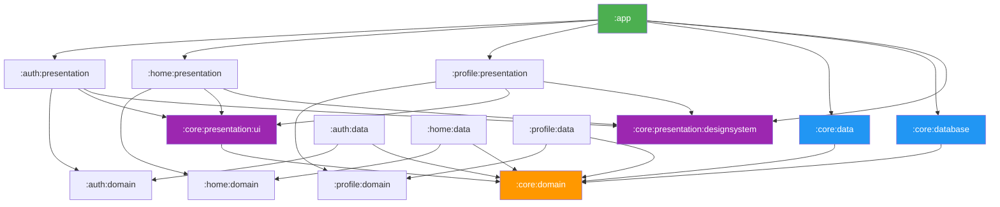

<p align="center">
  
  
  
  
  
  
</p>

# 🏗️ Android Multi-Module Clean Architecture Template

A **production-ready**, scalable Android project template built with **Jetpack Compose**, **multi-module Clean Architecture**, and **Gradle Convention Plugins**. Designed to bootstrap new projects in minutes — not days.

> **API Demo**: Uses [DummyJSON](https://dummyjson.com) for login, products, and user profile.

---

## ✨ Features

| Feature | Details |
|---|---|
| 🏛️ **Multi-Module Clean Architecture** | Strict `domain` → `data` → `presentation` layering per feature |
| 🎨 **Full Compose UI** | Material 3 Design System with Dark/Light theme + dynamic switching |
| 🔐 **Authentication** | Login with Bearer token, auto-refresh, encrypted session storage |
| 🌐 **Ktor Networking** | Type-safe HTTP client with Bearer auth, content negotiation, logging |
| 💾 **Room Database** | Offline-first with DAO, entities, and migration support |
| 🔄 **WorkManager Sync** | Background sync with exponential backoff + network constraints |
| 🧪 **Testing Infrastructure** | JUnit 5 + Turbine + Fakes, 90% coverage threshold via Kover |
| 🔧 **Convention Plugins** | Zero-boilerplate module setup via `build-logic` |
| 🌍 **Localization** | In-app language switching (EN/ID) with per-app locale support |
| 🛡️ **Security** | EncryptedSharedPreferences + network security config |
| 🚀 **Performance** | R8 shrinking, Baseline Profiles scaffold, Compose stability best practices |

---

## 📦 Module Structure

```
TemplateAndroidKotlin/
├── app/                              ← Application shell, navigation, DI wiring
├── build-logic/
│   └── convention/                   ← Gradle Convention Plugins (shared build config)
│
├── core/
│   ├── domain/                       ← Pure Kotlin: Result type, AuthInfo, SessionStorage
│   ├── data/                         ← Ktor client, encrypted session, OfflineFirst base
│   ├── database/                     ← Room database, DAOs, entities, migrations
│   └── presentation/
│       ├── designsystem/             ← Theme, colors, typography, reusable components
│       └── ui/                       ← ObserveAsEvents, UiText, shared Compose utilities
│
├── auth/
│   ├── domain/                       ← AuthRepository interface
│   ├── data/                         ← KtorAuthRepository, DTOs
│   └── presentation/                 ← LoginScreen, LoginViewModel (MVI)
│
├── home/
│   ├── domain/                       ← Product model, ProductRepository
│   ├── data/                         ← KtorRemoteProductDataSource, RoomLocalProductDataSource
│   └── presentation/                 ← HomeScreen, ProductUi mapper
│
└── profile/
    ├── domain/                       ← UserProfile model, ProfileRepository
    ├── data/                         ← KtorProfileDataSource, SharedPrefsAppSettings
    └── presentation/                 ← ProfileScreen with theme & language switching
```

### Module Dependency Graph



> **Rule**: `domain` modules are pure Kotlin (no Android dependencies). `data` modules never depend on `presentation`, and vice versa.

---

## 🚀 Getting Started

### Prerequisites

- **Android Studio**: Ladybug or newer
- **JDK**: 21+
- **Gradle**: 9.3+ (wrapper included)

### Setup

```bash
# Clone the repository
git clone https://github.com/firdaus1453/TemplateAndroidKotlin.git

# Open in Android Studio — Gradle sync will handle the rest
```

### Run

```bash
# Debug build
./gradlew assembleDebug

# Run unit tests
./gradlew testDebugUnitTest

# Coverage report (HTML at build/reports/kover/html/)
./gradlew koverHtmlReportMerged

# Verify 90% coverage threshold
./gradlew koverVerifyMerged
```

---

## 🏛️ Architecture

### MVI Pattern (Model-View-Intent)

Every feature follows the same predictable pattern:

```
User Action → ViewModel.onAction() → State Update → Compose Re-render
                    ↓ (one-time)
              Channel → Event → Toast/Navigate
```

### ViewModel Pattern

```kotlin
class FeatureViewModel(
    private val repository: FeatureRepository
) : ViewModel() {

    // ✅ Compose-native state — no collectAsState needed
    var state by mutableStateOf(FeatureState())
        private set

    // ✅ One-time events via Channel
    private val eventChannel = Channel<FeatureEvent>()
    val events = eventChannel.receiveAsFlow()

    fun onAction(action: FeatureAction) {
        when (action) {
            is FeatureAction.OnRefresh -> { /* ... */ }
            else -> Unit // Navigation handled by ScreenRoot
        }
    }
}
```

### ScreenRoot / Screen Pattern

```kotlin
// ScreenRoot: connects ViewModel + handles events
@Composable
fun FeatureScreenRoot(
    onNavigateToDetail: () -> Unit,
    viewModel: FeatureViewModel = koinViewModel()
) {
    ObserveAsEvents(viewModel.events) { event -> /* ... */ }

    FeatureScreen(
        state = viewModel.state,
        onAction = { action ->
            when (action) {
                is FeatureAction.OnItemClick -> onNavigateToDetail()
                else -> viewModel.onAction(action)
            }
        }
    )
}

// Screen: pure, stateless, previewable
@Composable
private fun FeatureScreen(
    state: FeatureState,
    onAction: (FeatureAction) -> Unit
)
```

---

## 🔧 Convention Plugins

Zero-boilerplate module configuration via `build-logic`:

| Plugin | Description |
|---|---|
| `template.android.application` | App module defaults (SDK, build types, R8) |
| `template.android.application.compose` | App + Compose compiler + dependencies |
| `template.android.library` | Library module defaults + Kover |
| `template.android.library.compose` | Library + Compose |
| `template.android.feature.ui` | Feature UI module (Compose + Koin + Navigation) |
| `template.android.room` | Room KSP + schema export |
| `template.android.dynamic.feature` | Dynamic feature module support |
| `template.jvm.library` | Pure Kotlin module (domain layers) |
| `template.jvm.ktor` | Ktor client + serialization |

### Adding a New Feature Module

```bash
# 1. Create the module directories
mkdir -p feature/domain/src/main/java/com/template/feature/domain
mkdir -p feature/data/src/main/java/com/template/feature/data
mkdir -p feature/presentation/src/main/java/com/template/feature/presentation
```

```kotlin
// feature/domain/build.gradle.kts
plugins {
    alias(libs.plugins.template.jvm.library)
}

// feature/data/build.gradle.kts
plugins {
    alias(libs.plugins.template.android.library)
    alias(libs.plugins.template.jvm.ktor)
}

// feature/presentation/build.gradle.kts
plugins {
    alias(libs.plugins.template.android.feature.ui)
}
```

Add to `settings.gradle.kts`:
```kotlin
include(":feature:domain")
include(":feature:data")
include(":feature:presentation")
```

---

## 🔐 Security

| Layer | Implementation |
|---|---|
| **Token Storage** | `EncryptedSharedPreferences` with AES256-GCM via AndroidX Security |
| **Network** | `networkSecurityConfig` forbids cleartext traffic |
| **Auth Flow** | Bearer token with automatic silent refresh via Ktor Auth plugin |
| **R8/ProGuard** | Enabled for release builds; library modules use consumer rules |

---

## 🧪 Testing

### Stack

| Library | Purpose |
|---|---|
| **JUnit 5** | Test framework (Jupiter API) |
| **Turbine** | Flow testing (events, state emissions) |
| **MockK** | Mocking (used sparingly — prefer Fakes) |
| **Kover 0.9.8** | Multi-module merged coverage reporting |

### Philosophy

- **Fakes over Mocks**: Every repository interface gets a `Fake*` implementation for tests
- **ViewModel-centric**: Test `onAction()` → verify `state` + `events`
- **90% threshold**: Enforced via `./gradlew koverVerifyMerged`

### Coverage Report

```bash
./gradlew koverHtmlReportMerged
open build/reports/kover/html/index.html
```

---

## 🛠️ Tech Stack

| Category | Library | Version |
|---|---|---|
| **Language** | Kotlin | 2.2.10 |
| **Build** | AGP | 9.1.1 |
| **UI** | Jetpack Compose (BOM) | 2025.04.00 |
| **Navigation** | Navigation Compose | 2.9.0 |
| **DI** | Koin | 4.0.4 |
| **Networking** | Ktor (CIO) | 3.1.2 |
| **Serialization** | Kotlinx Serialization | 1.8.1 |
| **Database** | Room | 2.7.1 |
| **Background** | WorkManager | 2.10.1 |
| **Async** | Coroutines | 1.10.2 |
| **Security** | EncryptedSharedPreferences | 1.1.0-alpha06 |
| **Images** | Coil | 2.6.0 |
| **Logging** | Timber | 5.0.1 |
| **Testing** | JUnit 5 / Turbine / MockK | 5.10.2 / 1.1.0 / 1.13.10 |
| **Coverage** | Kover | 0.9.8 |

---

## 📁 Key Files Quick Reference

| Pattern | Location |
|---|---|
| Result Type & DataError | `core/domain/.../util/Result.kt`, `DataError.kt` |
| HttpClient + Bearer Auth | `core/data/.../networking/HttpClientFactory.kt` |
| Safe Call Extensions | `core/data/.../networking/HttpClientExt.kt` |
| Session Storage | `core/domain/.../SessionStorage.kt` → `core/data/.../EncryptedSessionStorage.kt` |
| Theme (Dark/Light) | `core/presentation/designsystem/.../TemplateTheme.kt` |
| ObserveAsEvents | `core/presentation/ui/.../ObserveAsEvents.kt` |
| UiText | `core/presentation/ui/.../UiText.kt` |
| Navigation Routes | `app/.../Routes.kt` → `app/.../NavigationRoot.kt` |
| Convention Plugins | `build-logic/convention/src/main/java/` |
| Kover Config | `build.gradle.kts` (root) |

---

## 📐 Code Conventions

1. **Always use Timber** — never `Log.d()` or `println()`
2. **Domain = pure Kotlin** — no Android imports
3. **Compose state = `mutableStateOf`** in ViewModel, not `StateFlow`
4. **One-time events** via `Channel` → `receiveAsFlow()`
5. **ScreenRoot pattern** — `ScreenRoot` owns ViewModel, `Screen` is stateless
6. **Naming**: `KtorAuthRepository`, NOT `AuthRepositoryImpl`
7. **Mapper extensions**: `.toFeatureUi()`, `.toEntity()`, `.toFeature()`
8. **`@Serializable` Routes** — never use string-based navigation
9. **`CancellationException`** — always re-throw, never catch
10. **Locale-safe formatting** — always pass `Locale.US` to `String.format()`

---

## 📄 License

```
MIT License

Copyright (c) 2026

Permission is hereby granted, free of charge, to any person obtaining a copy
of this software and associated documentation files (the "Software"), to deal
in the Software without restriction, including without limitation the rights
to use, copy, modify, merge, publish, distribute, sublicense, and/or sell
copies of the Software, and to permit persons to whom the Software is
furnished to do so, subject to the following conditions:

The above copyright notice and this permission notice shall be included in all
copies or substantial portions of the Software.

THE SOFTWARE IS PROVIDED "AS IS", WITHOUT WARRANTY OF ANY KIND, EXPRESS OR
IMPLIED, INCLUDING BUT NOT LIMITED TO THE WARRANTIES OF MERCHANTABILITY,
FITNESS FOR A PARTICULAR PURPOSE AND NONINFRINGEMENT. IN NO EVENT SHALL THE
AUTHORS OR COPYRIGHT HOLDERS BE LIABLE FOR ANY CLAIM, DAMAGES OR OTHER
LIABILITY, WHETHER IN AN ACTION OF CONTRACT, TORT OR OTHERWISE, ARISING FROM,
OUT OF OR IN CONNECTION WITH THE SOFTWARE OR THE USE OR OTHER DEALINGS IN THE
SOFTWARE.
```
